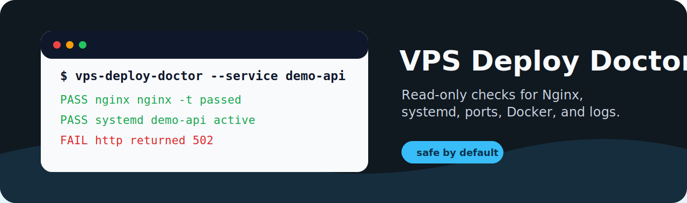
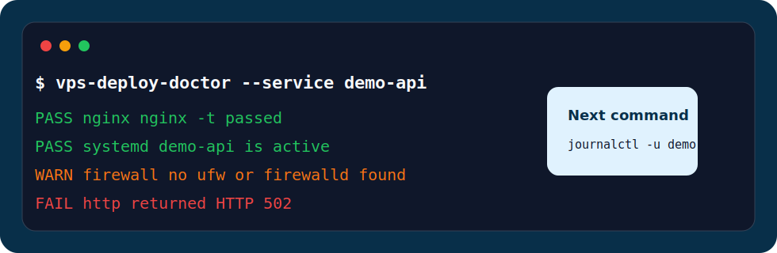

<p align="center">
  
</p>

<h1 align="center">VPS Deploy Doctor</h1>

<p align="center">
  <b>给学生 VPS 项目和个人 Web 应用准备的只读部署诊断工具。</b>
</p>

<p align="center">
  <a href="README.md">English</a>
  ·
  <a href="#快速开始">快速开始</a>
  ·
  <a href="#检查项">检查项</a>
  ·
  <a href="#排障地图">排障地图</a>
</p>

<p align="center">
  <a href="https://github.com/aolingge/vps-deploy-doctor/actions/workflows/validate.yml"></a>
  <a href="LICENSE"></a>
  <a href="https://github.com/aolingge/vps-deploy-doctor/releases"></a>
</p>

---

<table>
  <tr>
    <td width="25%" valign="top"><b>默认安全</b><br />不重启服务、不改防火墙、不写配置。</td>
    <td width="25%" valign="top"><b>定位层级</b><br />区分 Nginx、systemd、端口、防火墙、Docker、HTTP 问题。</td>
    <td width="25%" valign="top"><b>给下一条命令</b><br />直接提示下一步该看哪条日志。</td>
    <td width="25%" valign="top"><b>可脚本化输出</b><br />JSON lines 适合 CI、支持脚本和实验记录。</td>
  </tr>
</table>

<p align="center">
  
</p>

## 为什么做这个项目

学生项目上线后出现 `502`、`404` 或者完全打不开，通常是下面几个问题之一：

- Nginx 配置错误，或者改完没有 reload。
- Spring Boot / Node / Python 服务没跑起来。
- 应用端口写错了，或者端口没监听。
- 防火墙或云厂商安全组没放行 HTTP/HTTPS。
- 日志其实有，但不知道先看哪一个。

**VPS Deploy Doctor 做只读检查，并告诉你下一条该跑什么排障命令。**

## 快速开始

把脚本复制到 VPS 后运行：

```bash
bash bin/vps-deploy-doctor.sh \
  --url http://example.com \
  --service demo-api \
  --port 8080
```

用于自动化的 JSON 输出：

```bash
bash bin/vps-deploy-doctor.sh --json --url http://127.0.0.1 --port 8080
```

看到 summary 就说明工具跑通：

```text
PASS  nginx          nginx -t passed
WARN  firewall       no ufw or firewalld command found
FAIL  http           http://example.com returned HTTP 502

Summary: PASS=5 WARN=2 FAIL=1
```

## 检查项

| 检查项 | 能说明什么 |
| --- | --- |
| OS | 读取 Linux 发行版信息。 |
| Nginx | 执行 `nginx -t`，并检查 Nginx 服务是否 active。 |
| HTTP | 请求目标 URL 并显示状态码。 |
| Port | 检查目标应用端口是否有人监听。 |
| systemd | 检查应用服务是否 active。 |
| Firewall | 检测 UFW 或 firewalld 状态。 |
| Docker | 检查 Docker daemon 是否可用。 |
| 磁盘 / 内存 | 显示基础资源压力。 |
| Logs | 给出下一条最有用的日志命令。 |

## 排障地图

| 现象 | 先看这里 |
| --- | --- |
| `502 Bad Gateway` | 看 systemd、应用端口、Nginx upstream。 |
| 前端刷新后 `404` | 看 SPA fallback：`try_files $uri $uri/ /index.html;` |
| 域名打不开 | 看云安全组、防火墙、DNS、Nginx 服务。 |
| 本地能跑，VPS 不行 | 看 `--port`、`systemctl status` 和日志。 |
| Docker 应用挂了 | 看 `docker info` 和 `docker compose logs`。 |

## 安全边界

这个工具默认只读。它不会修改 Nginx、重启服务、改防火墙或上传日志。

不要把私有 IP、Token、Cookie、SSH key 或完整生产日志贴到公开 issue。

## 推荐搭配

- [Student Deploy Kit](https://github.com/aolingge/student-deploy-kit)
- Spring Boot + Nginx VPS 项目
- Vue / React 静态站部署
- Docker Compose 演示项目

## 参与贡献

适合新手的贡献方向：

- 增加 Caddy 检查。
- 增加云厂商元数据检查。
- 增加 Ubuntu / Debian 示例。
- 增加 Windows Server PowerShell 版本。
- 优化 JSON 报告格式。

运行校验：

```bash
bash test/validate.sh
```

## License

MIT
